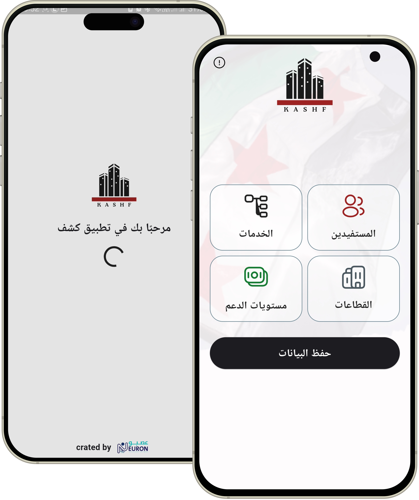
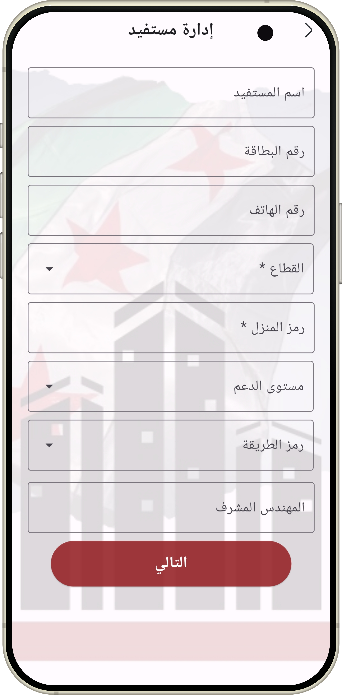
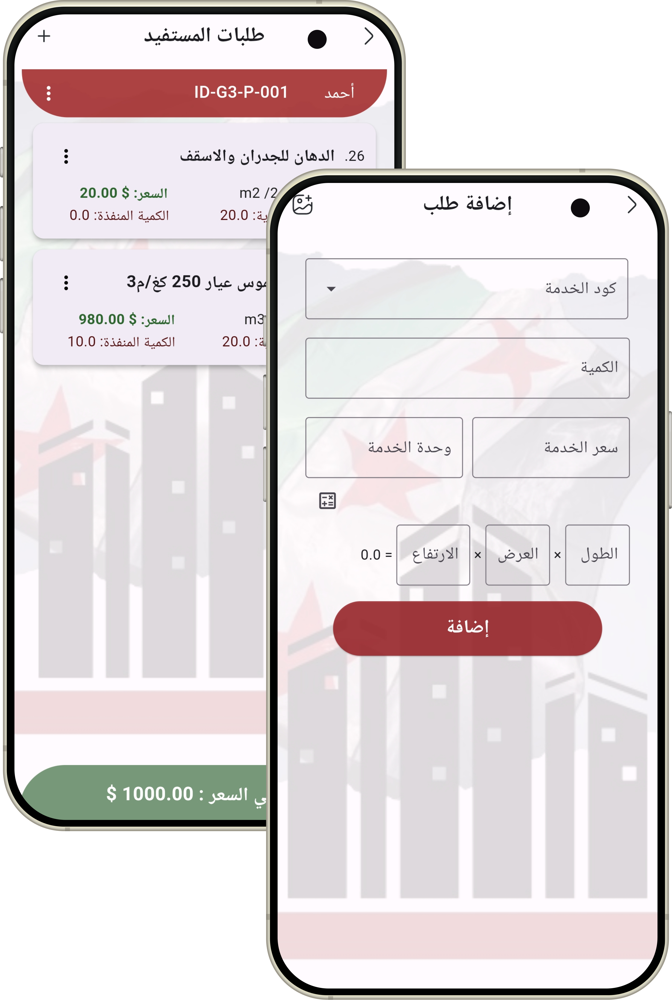
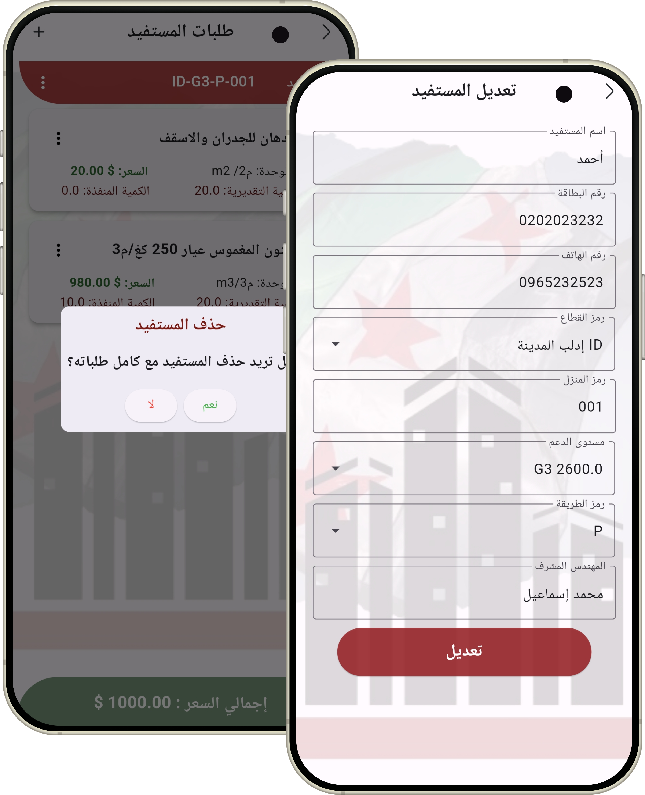
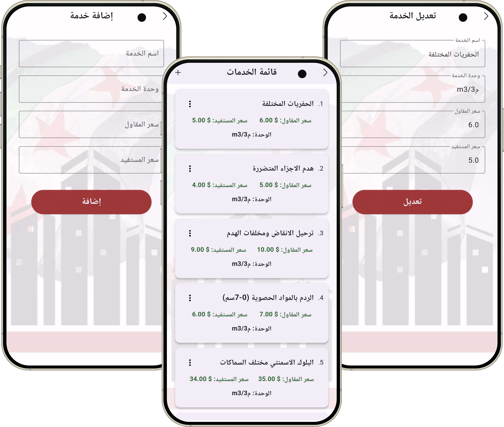
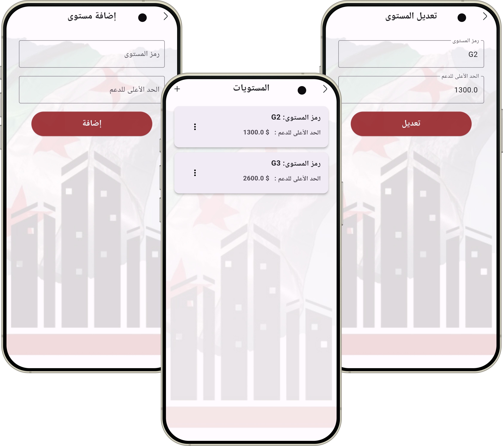
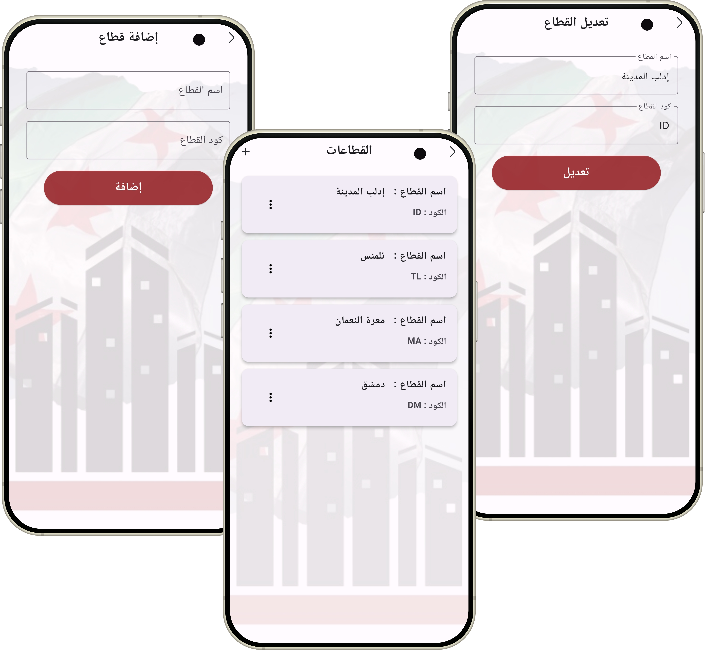

# kashf-Application
Developed a reconstruction support application with a main dashboard featuring beneficiaries, services, sectors, and support levels. The app enables beneficiary registration, service assignment with budget limits, full CRUD operations for services and sectors, configurable support levels, and data export to Excel for reporting and analysis.

  
  
  
  
  
  
  

